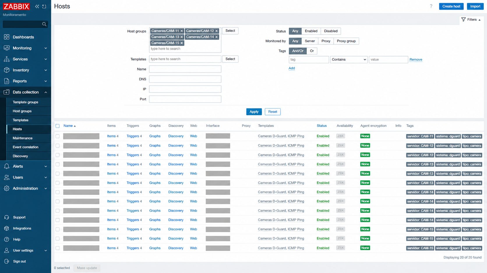
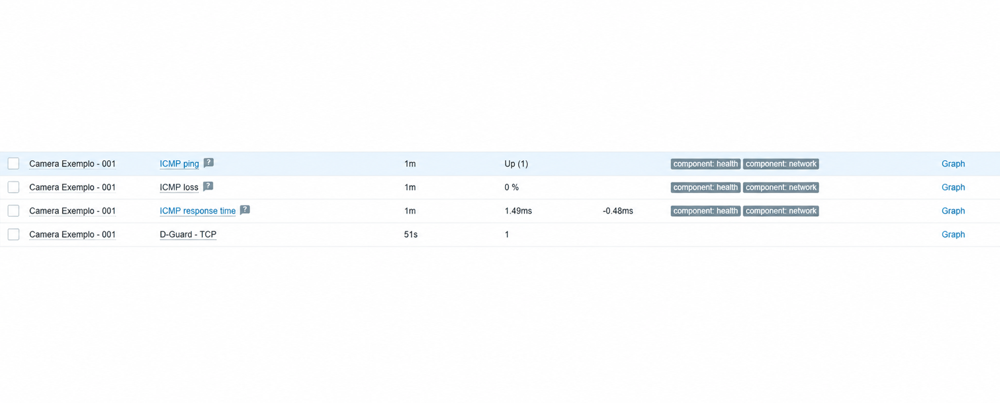
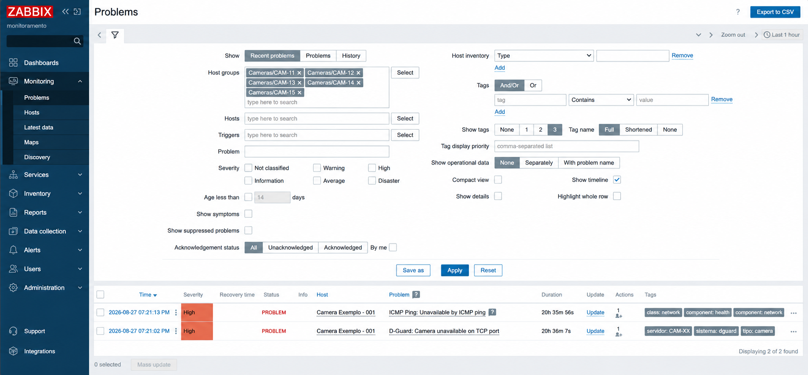
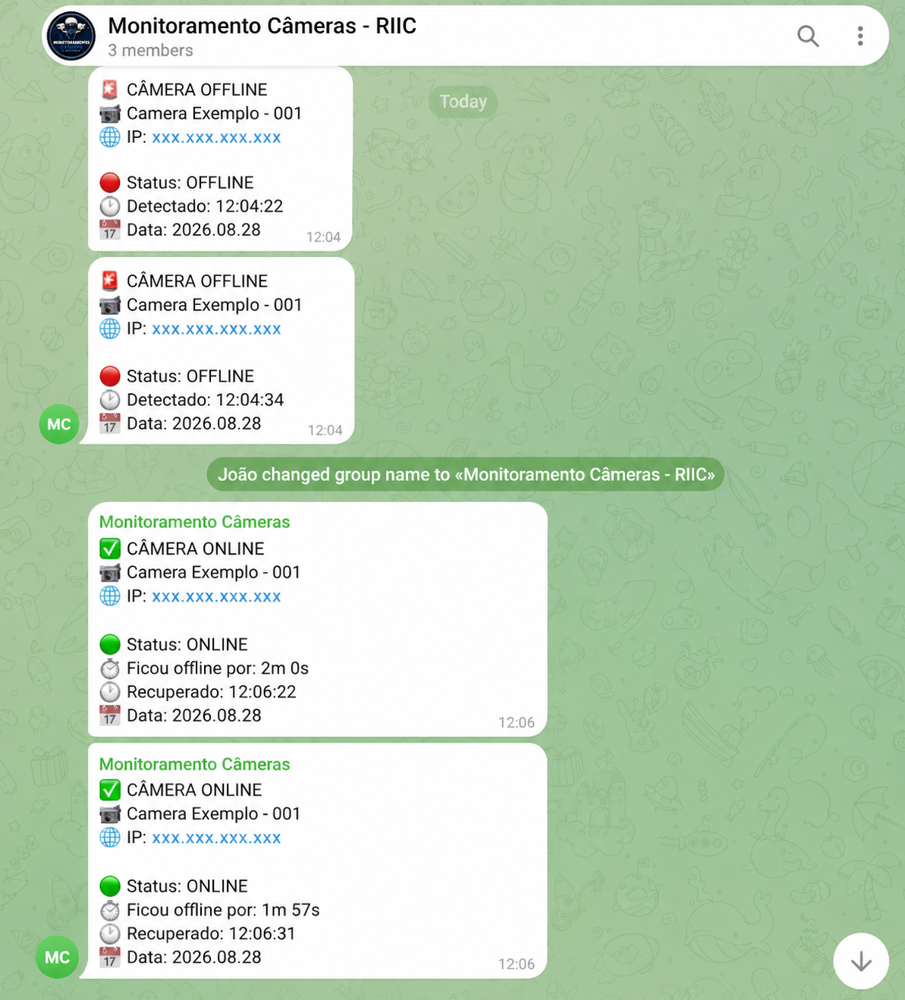

# Monitoramento de Câmeras IP com Zabbix, Python e Telegram

Projeto desenvolvido para centralizar o monitoramento de uma infraestrutura com **178 câmeras IP**, utilizando **Zabbix**, automações em **Python** e alertas via **Telegram**.

A ideia surgiu da necessidade de identificar de forma mais rápida câmeras offline ou com problemas de comunicação, sem depender da verificação manual de cada equipamento no sistema de CFTV.

## O problema

Com uma quantidade grande de câmeras IP, verificar manualmente se cada equipamento estava funcionando acabava sendo trabalhoso.

Além disso, somente o ping não era suficiente. Em alguns casos a câmera continuava respondendo na rede, mas o serviço utilizado pelo sistema de monitoramento de vídeo não estava disponível.

Por isso, o monitoramento foi dividido em dois pontos:

- **ICMP (ping):** verifica se o equipamento está acessível na rede;
- **TCP:** verifica se o serviço da câmera está respondendo na porta configurada.

Assim consigo diferenciar uma câmera completamente offline de uma câmera que ainda responde na rede, mas está com problema no serviço TCP.

---

## Como ficou o monitoramento

Atualmente são monitoradas **178 câmeras IP**, separadas em 5 grupos:

| Grupo | Quantidade |
|------|-----------:|
| CAM-11 | 40 |
| CAM-12 | 47 |
| CAM-13 | 44 |
| CAM-14 | 19 |
| CAM-15 | 28 |
| **Total** | **178** |

Cada câmera possui monitoramento de ICMP e TCP, além de tags e grupos para facilitar a organização dentro do Zabbix.

Alguns equipamentos utilizam portas TCP diferentes, então a porta pode ser configurada individualmente através de uma macro no host.

### Hosts no Zabbix

As câmeras são organizadas em grupos e recebem os templates, tags e configurações necessárias para o monitoramento.



### Verificação ICMP e TCP

Nos dados mais recentes é possível acompanhar separadamente a disponibilidade da câmera na rede e do serviço TCP.



---

## Arquitetura

O funcionamento do projeto ficou basicamente assim:

```text
                  +------------------+
                  |    Câmeras IP    |
                  +--------+---------+
                           |
                      ICMP + TCP
                           |
                           v
                  +------------------+
                  |      Zabbix      |
                  |                  |
                  | Items / Triggers |
                  +----+--------+----+
                       |        ^
             problema  |        | recuperação
                       v        |
                  +------------------+
                  |     Telegram     |
                  +--------+---------+
                           |
                           v
                    Equipe técnica


        +----------------------------+
        |           Python           |
        |                            |
        | Importação em massa        |
        | Dry Run                    |
        | Auditoria                  |
        +-------------+--------------+
                      |
                 Zabbix API
                      |
                      v
                   Zabbix
```

---

## Automações em Python

Como eram muitas câmeras para cadastrar manualmente, utilizei Python para automatizar parte do processo através da **API do Zabbix**.

Os scripts deste repositório representam essa parte do projeto.

### `import_cameras.py`

Responsável pela criação dos hosts no Zabbix a partir de uma planilha Excel.

Antes de criar cada host, o script verifica se já existe:

- uma câmera com o mesmo nome;
- uma câmera utilizando o mesmo IP.

Durante a criação são configurados automaticamente:

- grupo;
- templates;
- interface e IP;
- tags;
- macro com a porta TCP.

Antes de iniciar a importação real, o script ainda exige uma confirmação manual digitando:

```text
IMPORTAR
```

Isso evita iniciar uma criação em massa por engano.

### `dry_run.py`

Antes da importação real, utilizei um **dry run** para validar os dados da planilha.

O script consulta o Zabbix e informa:

- quais câmeras seriam criadas;
- quais já existem;
- possíveis conflitos de IP.

No final é apresentado um resumo da validação e **nenhum host é criado ou alterado**.

### `audit_cameras.py`

Depois do cadastro, também criei um script para consultar o estado das câmeras através da API do Zabbix.

A auditoria utiliza os últimos resultados de ICMP e TCP para classificar cada equipamento:

| Status | Situação |
|--------|----------|
| `OK` | ICMP e TCP funcionando |
| `TCP_FALHA` | responde ao ping, mas o serviço TCP não responde |
| `OFFLINE` | ICMP e TCP indisponíveis |
| `ESTRANHO` | TCP responde mesmo sem resposta ICMP |
| `SEM_DADOS` | ainda não existem dados suficientes |

No final são exibidos um resumo por grupo, um resumo geral e a relação das câmeras que precisam de atenção.

---

## Detecção de problemas

Os triggers do Zabbix identificam tanto problemas de conectividade quanto falhas no serviço TCP.

Dessa forma, uma indisponibilidade pode ser identificada pelo ICMP, pelo serviço da câmera ou pelos dois testes.



---

## Alertas pelo Telegram

Também configurei o Zabbix para enviar automaticamente as notificações para um grupo no Telegram utilizado pela equipe técnica.

Quando uma câmera fica indisponível, o grupo recebe um alerta no formato:

```text
🚨 CÂMERA OFFLINE

📹 Nome da câmera
🌐 IP: xxx.xxx.xxx.xxx

🔴 Status: OFFLINE
🕐 Detectado: horário
📅 Data: data
```

Quando a comunicação é restabelecida, também é enviada uma notificação de recuperação:

```text
✅ CÂMERA ONLINE

📹 Nome da câmera
🌐 IP: xxx.xxx.xxx.xxx

🟢 Status: ONLINE
⏱ Ficou offline por: duração
🕐 Recuperado: horário
📅 Data: data
```

Assim, a equipe recebe tanto a identificação da falha quanto a confirmação de que o equipamento voltou a funcionar.



---

## Tecnologias utilizadas

- **Zabbix** — monitoramento, items, triggers e alertas;
- **Python 3** — automação e auditoria;
- **Zabbix API / JSON-RPC** — integração dos scripts com o Zabbix;
- **Requests** — requisições HTTP para a API;
- **OpenPyXL** — leitura das planilhas Excel;
- **Telegram Bot API** — envio das notificações;
- **ICMP e TCP/IP** — verificações de disponibilidade e comunicação.

---

## Estrutura do repositório

```text
camera-monitoring-zabbix/
├── docs/
│   └── images/
│       ├── hosts.png
│       ├── latest-data.png
│       ├── problems.png
│       └── telegram-alerts.png
│
├── scripts/
│   ├── import_cameras.py
│   ├── dry_run.py
│   └── audit_cameras.py
│
├── .gitignore
├── README.md
└── requirements.txt
```

---

## Executando os scripts

Instale as dependências:

```bash
pip install -r requirements.txt
```

Configure o endereço da API:

```bash
export ZABBIX_URL="https://zabbix.example.com/api_jsonrpc.php"
```

O token é utilizado através de variável de ambiente e não fica salvo dentro dos scripts:

```bash
read -s ZABBIX_TOKEN
export ZABBIX_TOKEN
```

### Dry Run

```bash
python scripts/dry_run.py \
  --excel cameras.xlsx \
  --sheet CAM-01 \
  --group-name "Cameras/CAM-01"
```

### Importação

```bash
python scripts/import_cameras.py \
  --excel cameras.xlsx \
  --sheet CAM-01 \
  --group-id 123 \
  --server-tag CAM-01 \
  --template-tcp-id 456 \
  --template-icmp-id 789
```

### Auditoria

Os grupos podem ser informados através de uma variável de ambiente:

```bash
export CAMERA_GROUPS='{"CAM-01":"123","CAM-02":"124"}'
```

Depois:

```bash
python scripts/audit_cameras.py
```

---

## Segurança

Como este repositório é público, informações específicas do ambiente real foram removidas ou substituídas.

Entre elas:

- IPs internos;
- tokens e credenciais;
- IDs reais de grupos e templates;
- caminhos internos do servidor;
- nomes e informações específicas da infraestrutura.

Os scripts publicados aqui foram adaptados a partir dos scripts utilizados durante a implantação real.

---

## Resultado

Ao final da implantação, ficaram **178 câmeras IP monitoradas**, divididas em 5 grupos.

Além do monitoramento ICMP e TCP, parte do processo de cadastro e auditoria foi automatizada com Python e os alertas de indisponibilidade e recuperação passaram a ser enviados automaticamente para a equipe técnica pelo Telegram.

O projeto me permitiu trabalhar na prática com **monitoramento de infraestrutura, redes, Linux, Python, APIs e automação**, além de resolver um problema real do dia a dia da equipe de TI.
